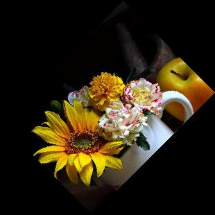

.. header:: `Home </>`_ > `Pillow by Example </pillow/>`_ > `Basics </pillow/basics/>`_ > `Rotate </pillow/basics/rotate/>`_

Pillow by Example
~~~~~~~~~~~~~~~~~

Rotating Images
===============

.. contents::
    :depth: 2
    :backlinks: top

.. sectnum::

Preparations
------------

Import Pillow:

.. include:: rotate.py
    :code: python
    :start-after: # -(0)
    :end-before: # -(/0)

Load the original image:

.. include:: rotate.py
    :code: python
    :start-after: # -(1)
    :end-before: # -(/1)

    The original image

Counterclockwise Rotation
-------------------------

.. include:: rotate.py
    :code: python
    :start-after: # -(2)
    :end-before: # -(/2)

    Rotated by 45 degrees

.. include:: rotate.py
    :code: python
    :start-after: # -(3)
    :end-before: # -(/3)

    Rotated by 90 degrees

Clockwise Rotation
------------------

.. include:: rotate.py
    :code: python
    :start-after: # -(4)
    :end-before: # -(/4)

    Rotated by 45 degrees (clockwise)

Disable cropping of output image
--------------------------------

.. include:: rotate.py
    :code: python
    :start-after: # -(5)
    :end-before: # -(/5)

    Uncropped version of rotated image

Apply a resampling filter
-------------------------

.. include:: rotate.py
    :code: python
    :start-after: # -(6)
    :end-before: # -(/6)

    Use nearest neighbor (default)

.. include:: rotate.py
    :code: python
    :start-after: # -(7)
    :end-before: # -(/7)

    Use linear interpolation

.. include:: rotate.py
    :code: python
    :start-after: # -(8)
    :end-before: # -(/8)

    Use cubic spline interpolation

.. footer:: Copyright 2014 `Matthias Eisen </>`__
